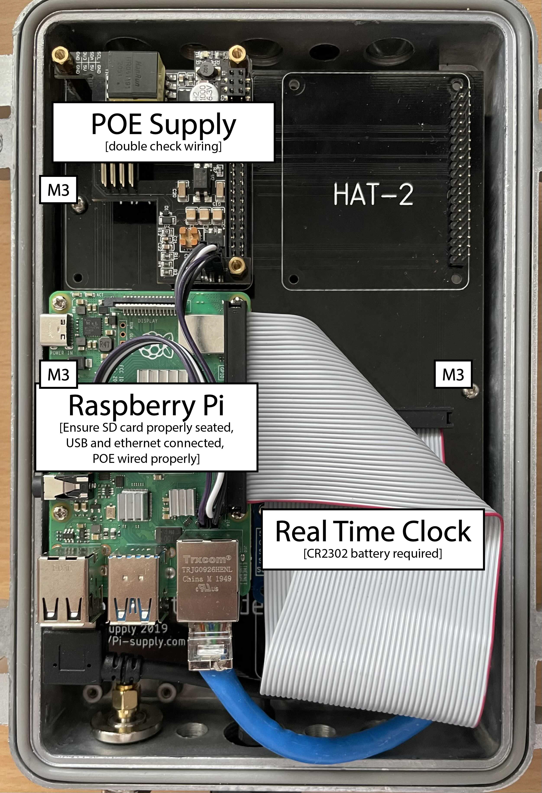
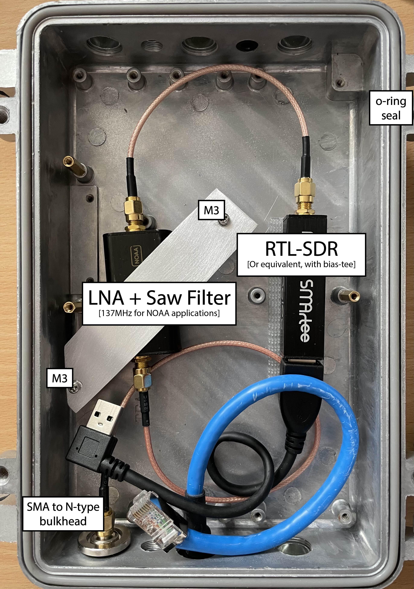

# Ground Station | Receiver Station

This project contains notes, code, and setup instructions for a Ground Station NOAA satellite receiver, which autonomously collects APT transmissions from weather satellites NOAA-15, NOAA-18, and NOAA-19 as they fly overhead, breaks the transmissions into short, CDN-able chunks, and pushes the chunks to a cloud webserver as they come in.

The code is intended to be deployed on a Raspberry Pi 4 running Arch Linux ARM and Python 3, and depends on several other packages.

Receiver Station draws on portions of [autowx](https://github.com/cyber-atomus/autowx) for inspiration. On the recording side, the most significant functional difference between Receiver Station and autowx is the breaking up of the audio recording and decoded image into short chunks for a close-to-realtime online experience. Receiver Station also depends on noaa-apt instead of wxtoimg.

Before running, ensure that all dependencies are installed, and that Boto3 is properly configured for access to your personal S3 and SQS, if using AWS. A setup guide is available [here](https://boto3.amazonaws.com/v1/documentation/api/latest/guide/quickstart.html#configuration). Configuration is set via `groundstation.cfg`, which is loaded by `groundstation.py`.

Updated TLEs can be retrieved using a `updateTLE.sh` or inline in `groundstation.py`. Due to firewall limitations in our final installation, we mirror the TLEs on our AWS instance and retrieve from there. `groundstation.py` also attempts to retrieve and set local time from the AWS / application server instance, as public ntp was not available in our installation setting.

### Dependencies

- python3
- [predict](https://github.com/kd2bd/predict/): install from repositories
- [pypredict](https://github.com/nsat/pypredict): build from source to avoid a urllib2 / python3 issue
- sox: install from repositories
- pysox: pip install sox
- twolame: install from repositories
- boto3: pip install boto3 (pip)
- configparser: pip install configparser
- [noaa-apt](https://github.com/martinber/noaa-apt): releases are available for various platforms or build from source. only the command line version is needed.
- [Supervisord](http://supervisord.org/) (optional): install from repositories

### Running as a service

Example systemd service files are available for both `updateTLE.sh` and `groundstation.py`. Supervisord configuration is also provided. For convenient process control and debugging, we use supervisord in place of systemd so as to allow local support at the installation site to review program logs through supervisord's simple web interface on `localhost:9001`. 

### Testing and debugging

[ngrok](https://ngrok.com/) is a useful tool for tunneling to an embedded computer in case of fixes needed or to review data. In addition to uploading the recordings to AWS, we expose them via local webserver and use ngrok to make them securely available to the internet when necessary. This feature defaults off, and can be turned on locally via the supervisord web interface at `localhost:9001`, along with a reverse ssh tunnel option.

A few test scripts are available in the [test directory](test/), and do not require installation of most of the dependencies below. See the separate README in [test](test/) for usage instructions.

### Hardware

- [Nooelec NESDR SMArTee v2 SDR](https://www.nooelec.com/store/nesdr-smartee-sdr.html): any RTL-SDR compatible device with bias tee will work
- [Nooelec SAWbird+ NOAA](https://www.nooelec.com/store/sdr/sdr-addons/sawbird/sawbird-plus-noaa-308.html): 137MHz SAW Filter and LNA, not required but improves signal
- [Diamond KE-137 QFH Antenna](https://www.wimo.com/en/ke-137): RHCP antenna for 137MHz (or [build one!](https://www.instructables.com/NOAA-Satellite-Signals-with-a-PVC-QFH-Antenna-and-/))
- [Raspberry Pi 4 Model B](https://www.raspberrypi.org/products/raspberry-pi-4-model-b/) or equivalent
- [Nebra IP67 Waterproof/Weatherproof Enclosure](https://uk.pi-supply.com/products/die-cast-outdoor-weatherproof-enclosure), option with pre-installed PoE cable gland
- [HAT Mounting Raspberry Pi Expansion Board](https://uk.pi-supply.com/products/nebra-ip67-case-gateway-hat-mounting-and-expansion-board)
- [PoE Hat with isolation](https://www.loverpi.com/collections/raspberry-pi-poe-hat/products/loverpi-poe-hat-for-raspberry-pi-4?variant=39317204992058)
- [Real time clock (RTC)](https://uk.pi-supply.com/products/rtc-pi)
- [Amphenol 242125 SMA Jack to N-type Bulkhead](https://www.mouser.fr/ProductDetail/amphenol/242125/?qs=d6ov5MOrwvFQ0NGbrnP6Gg==)
- [M10 vent plug with o-ring](https://www.mouser.fr/ProductDetail/bud-industries/ipv-67101-b/?qs=BJlw7L4Cy7%2FefKOhF054KA==)
- [50ohm coax](https://www.wimo.com/en/40335-x)
- [Lightning arrester](https://www.amazon.fr/gp/product/B072DW4FD2) (generic n-type coax)
- [Right angle usb extension (15cm)](https://www.amazon.fr/gp/product/B0734K52BH)
- [SMA male to SMA male RG316](https://www.amazon.fr/BOOBRIE-Adaptateur-dAntenne-Connecteur-Rallonge/dp/B07K35P9N2/), 2 required
- M2.5 and M3 hardware (stand-offs and screws)
- Silica gel packets
- [Self-amalgamating tape](https://www.amazon.fr/gp/product/B00WSLTVFY/)
- CR2302 coin cell battery for real time clock (RTC)

### Setup

 
